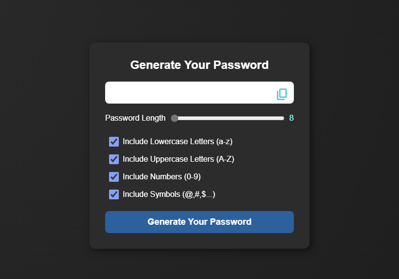

# 🔐 Password Generator  
*A secure password generator built with HTML, CSS, and JavaScript.*  

## 📸 UI Overview
<div align="center">
  
  <p><em>Password generator interface with customization options</em></p>
</div>

## ✨ Features  
- Customizable password length (8-30 characters)  
- Option to include/exclude:  
  - Lowercase letters (a-z)  
  - Uppercase letters (A-Z)  
  - Numbers (0-9)  
  - Symbols (@,#,$...)  
- One-click copy to clipboard  
- Visual feedback when password is copied  

## 🛠️ Tech Stack  
- **Frontend**: Vanilla JavaScript, CSS3, HTML5  
- **Special Features**:  
  - Dynamic character set based on user selection  
  - Copy feedback with icon change and message  
  - Sleek dark mode UI with frosted glass effect  
  - Responsive design  

## 🛠️ Run Locally  
```bash
git clone https://github.com/your-username/password-generator.git
open password.html